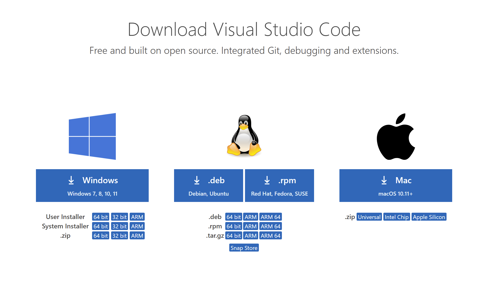
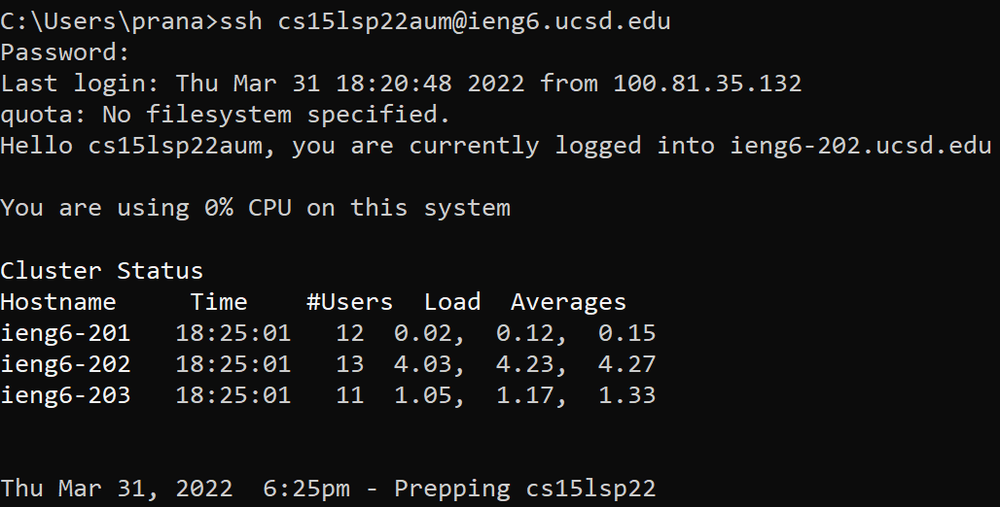
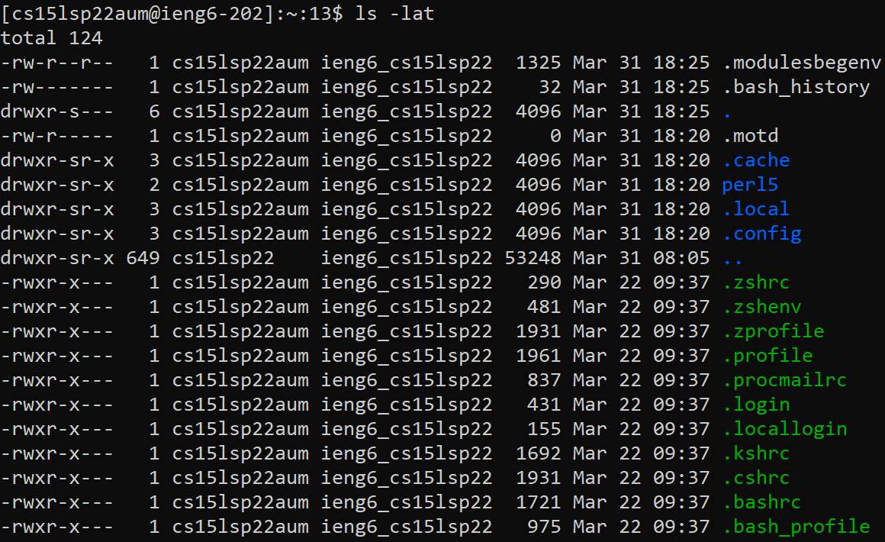
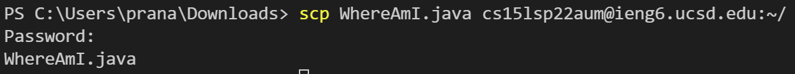
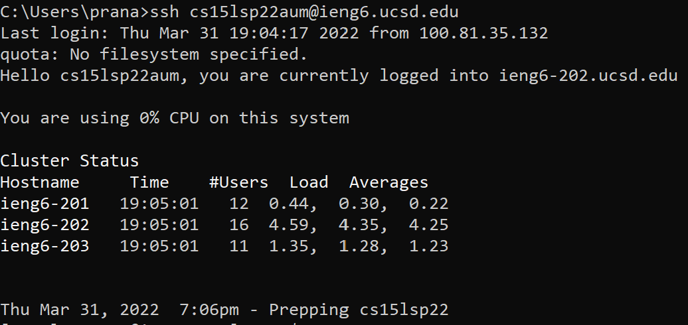
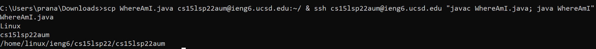

# Lab Report 1

## Installing VSCode
* To install VSCode, simply visit [this link](https://code.visualstudio.com/download).
* Make sure to download the correct version for your system!

## Remotely Connecting
* To remotely connect to the UCSD basement computers, we need to use our course specific login information, which can be found [here](https://sdacs.ucsd.edu/~icc/index.php).
* If you are using a Windows system, you must first install [OpenSSH](https://www.openssh.com/).
* Next, open a terminal window and enter the following command: `$ ssh cs15lwi22xyz@ieng6.ucsd.edu`, replacing `xyz` with your course specific login characters.
* Then enter your password, and press enter.

## Trying Some Commands
* Here are some example Unix commands:

`pwd: print working directory`

`ls: list files`

`cp: copy`

`mv: move or rename`

`mkdir: make director`

`rm: remove`

`cat: view or create a file`

`touch: create a file`

`man: display command manual`

* This is an example of the `ls -lat` command, which shows a list of all files sorted by date:

## Moving Files with `scp`
* To move files from your local machine to the remote server, we use the `scp` command in the following format: `$ scp filename cs15sp22xyz@ieng6.ucsd.edu:~/`.
* After entering the command, you will be prompted to enter your password.
* Below is an example of moving a file called WhereAmI.java to the remote server using the `scp` command:

## Setting an SSH Key
* An SSH Key allows us to run commands on the remote server without having to enter our password every time.
* First we use the ``$ ssh -keygen`` on our local system to generate an SSH key.
* Then, we log into our remote server, and create a directory as follows: `$ mkdir .ssh`. This is where we will store our SSH key.
* After exiting the remote server, we use the `scp` command to move our SSH key from our local system to the remote server:

``
$ scp /Users/prana/.ssh/id_rsa.pub cs15lwi22xyz@ieng6.ucsd. edu:~/.ssh/authorized_keys
``
* Now when we try to log into our remote server, we will no longer be prompted for our password and will be granted automatic access.

## Optimizing Remote Running
* Typing many commands one after the other can get quite tedious and cumbersome.
* Luckily we can log into the remote server and run multiple commands at the same time in just one line.
* Below is an example of moving a file into the remote server, compiling the file, and then running it all at once:

