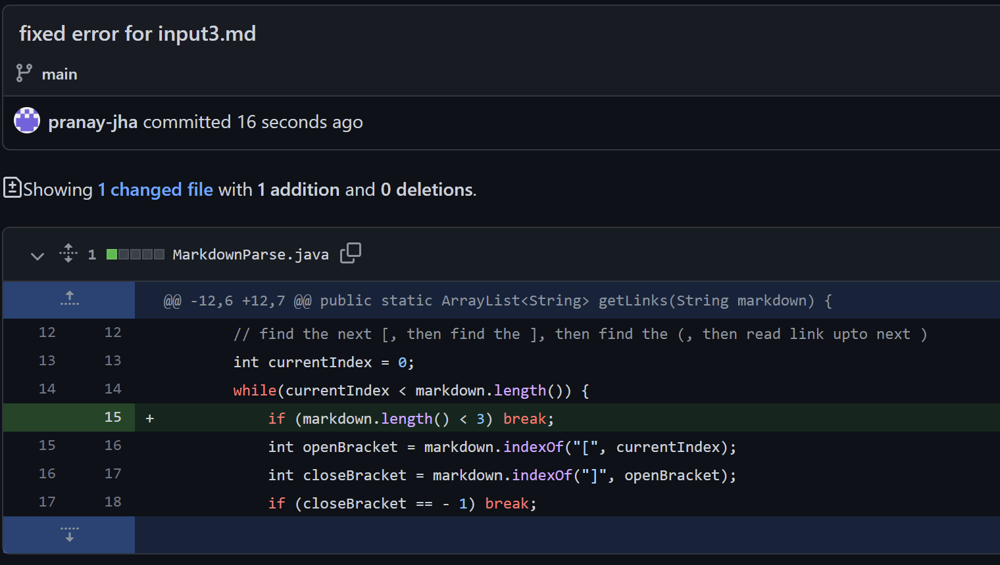

# Lab Report 2

## Code Change 1

[Link to failure-inducing input](input1.md)

Symptom:
```
PS C:\Users\prana\OneDrive\Documents\GitHub\markdown-parser> java MarkdownParse input1.md
Exception in thread "main" java.lang.OutOfMemoryError: Java heap space

        at java.base/java.lang.StringLatin1.newString(StringLatin1.java:769)

        at java.base/java.lang.String.substring(String.java:2709)

        at MarkdownParse.getLinks(MarkdownParse.java:45)

        at MarkdownParse.main(MarkdownParse.java:59)
```

The first bug I encountered was a case where there is a open bracket by itself (``[``) and the code would try to find the index of a closed bracket after it, but would not find one and the ``indexOf`` method would return ``-1`` as a result. Later it would also set the closed parenthesis index to ``-1`` as the ``[`` was the last character in the file. The value of ``currentIndex`` would always be ``0``, and the while loop would run infinitely since it will always be smaller than the length of the file. Additionally, there is an error when trying to create the substring of the contents between the parantheses due to faulty indices.

## Code Change 2

[Link to failure-inducing input](input2.md)

Symptom:
```
PS C:\Users\prana\OneDrive\Documents\GitHub\markdown-parser> javac MarkdownParse.java  
```
> No error message due to the infinite loop.


The second bug I encountered was that if there was a file with no parenthesis and with brackets, the code would try to set ``currentIndex`` to the index of the next open bracket that it finds. But if there are none, then currentIndex is just set to ``-1``, which results in an infinite loop.

## Code Change 3

[Link to failure-inducing input](input3.md)

Symptom:
```
PS C:\Users\prana\OneDrive\Documents\GitHub\markdown-parser> java MarkdownParse input3.md
Exception in thread "main" java.lang.StringIndexOutOfBoundsException: String index out of range: 1
        at java.base/java.lang.StringLatin1.charAt(StringLatin1.java:48)   
        at java.base/java.lang.String.charAt(String.java:1512)
        at MarkdownParse.getLinks(MarkdownParse.java:18)
        at MarkdownParse.main(MarkdownParse.java:60)
```

The third bug I encountered was when there is simply one closed bracket in the file. This would result in a ``IndexOutOfBoundsException`` for index ``1`` since we are checking for a colon right after the closed bracket, which doesn't exist (only index ``0`` exists) and is out of bounds for the given markdown file. I created a catch-all and checked if the length of the markdown file was greater than 2, because otherwise you would not be able to include a link in the first place.