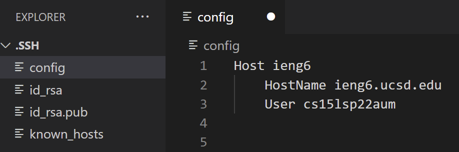
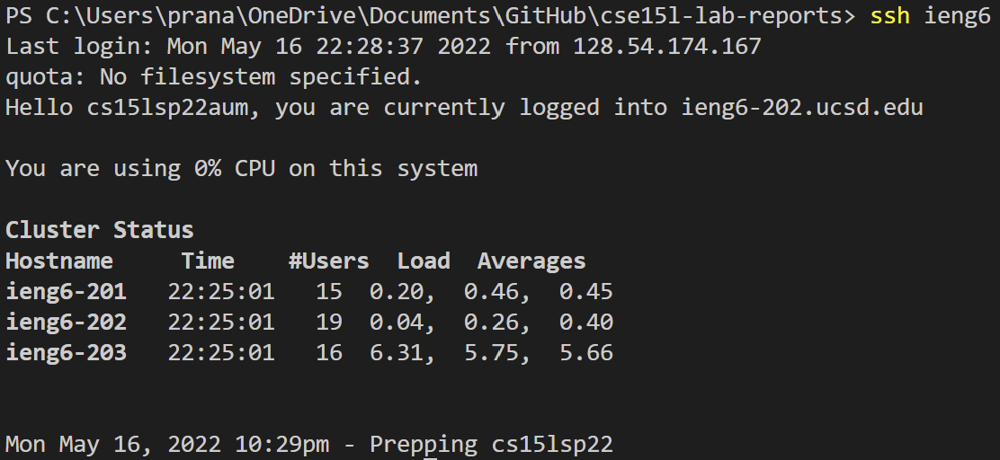
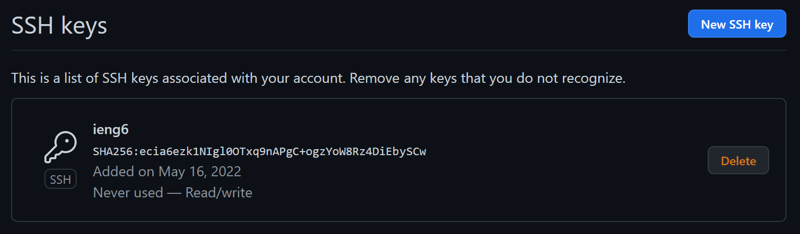

# Lab Report 3

## Streamlining ssh Configuration
I added and edited my config file as shown below:

Logging in with new alias:

Copying over a file using the new config:

## Setup Github Access from ieng6
Public key on Github:

Private key on user:

Pushing on ieng6:

## Copy whole directories with scp -r
