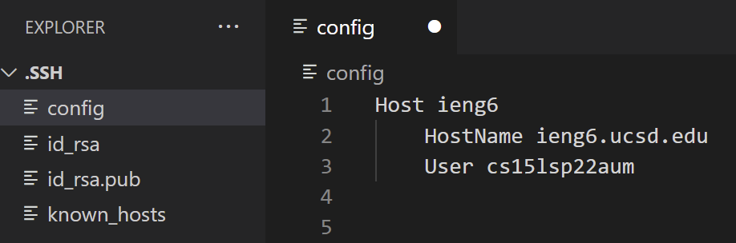
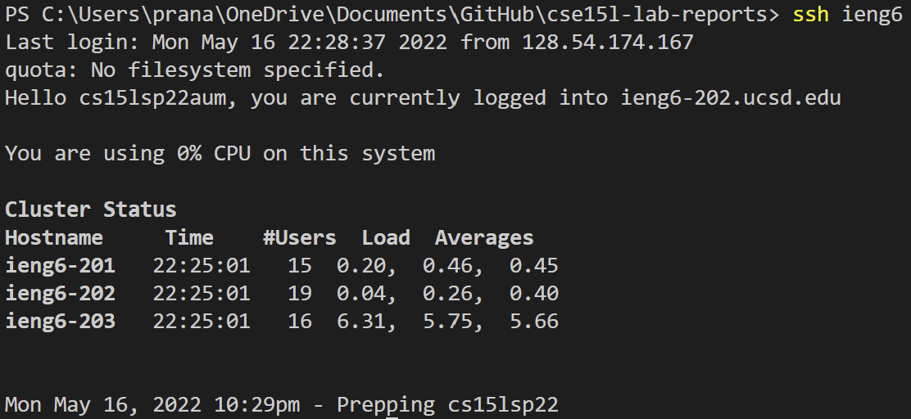
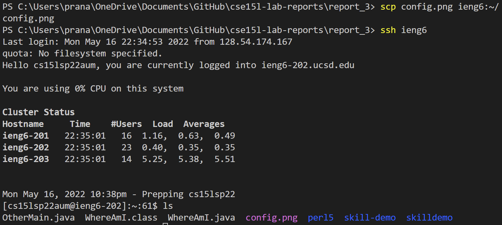
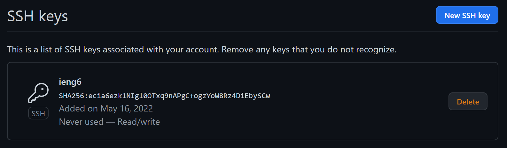
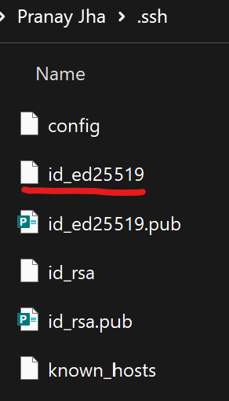
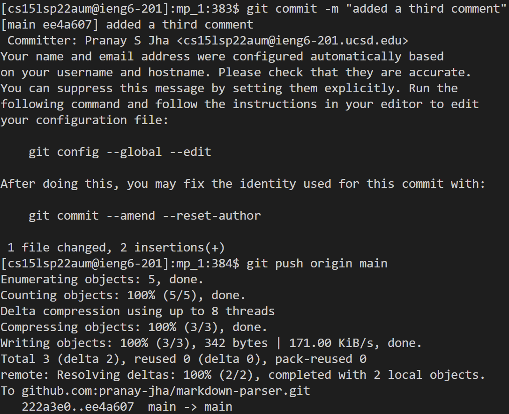
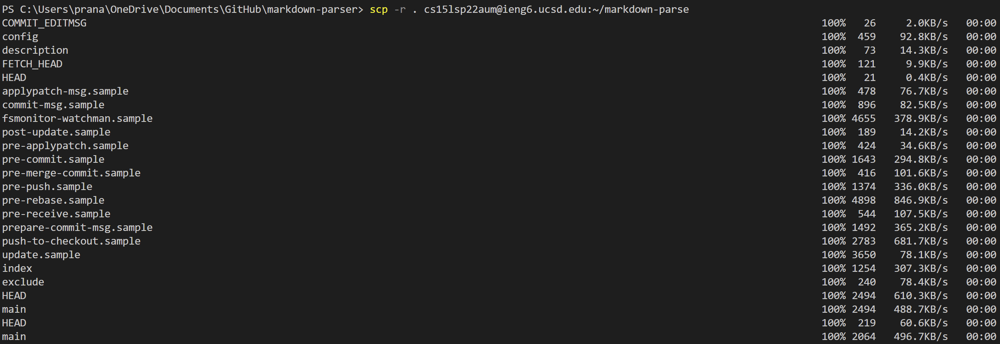
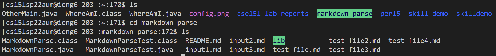
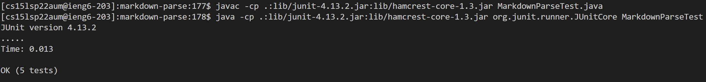
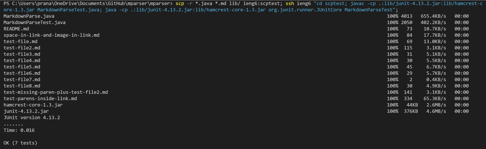

# Lab Report 3

## Streamlining ssh Configuration
I added and edited my config file as shown below:

Logging in with new alias:

Copying over a file using the new config:

## Setup Github Access from ieng6
Public key on Github:

Private key on user account:

Commiting and pushing on user account:

[Link to commit](https://github.com/pranay-jha/markdown-parser/commit/ee4a60734ec6717488535fdfa7ca132ff336145c)

## Copy whole directories with scp -r

Copying the directory:

Confirming that it is now on my ieng6 account:

Compiling and running tests:

Copying the directory and running tests in one line:
