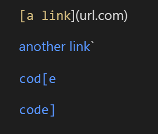
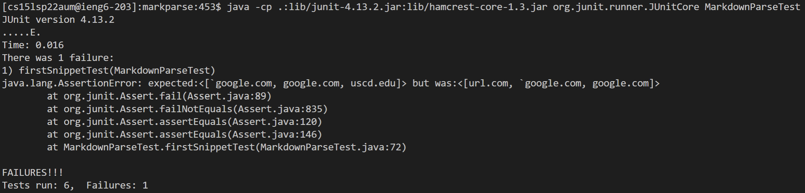
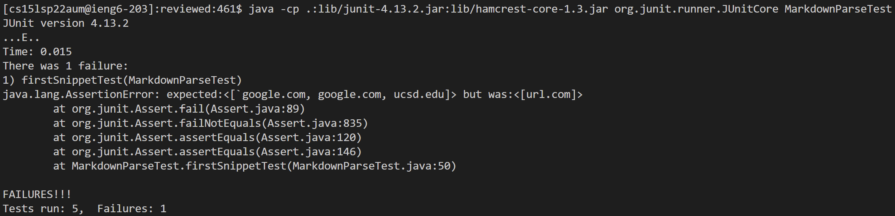
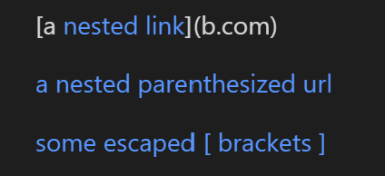
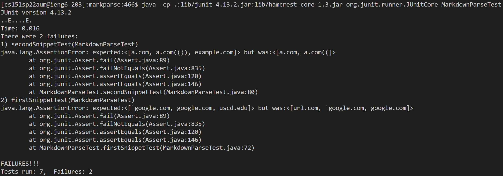
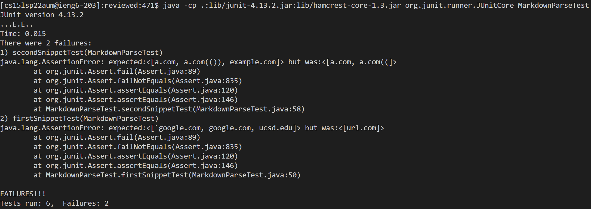
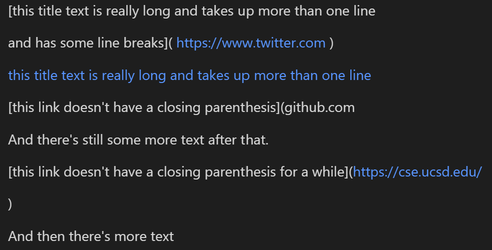
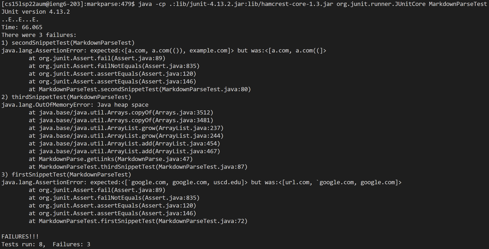
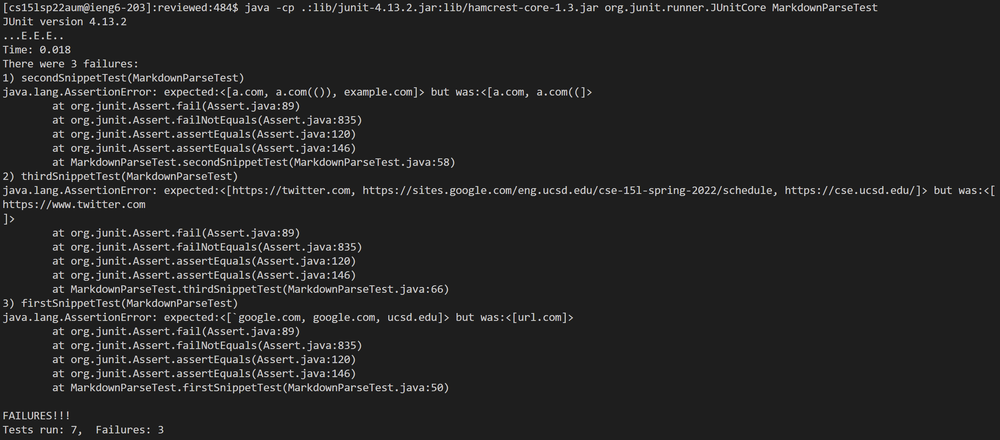

# Lab Report 4

## Repo Links
[My repo](https://github.com/pranay-jha/markdown-parser)

[Reviewed repo](https://github.com/hsflores7/markdown-parser)

## Snippet 1 Tests
This is the VSCode preview for snippet 1:



When we run ``MarkdownParse``, we should get a list with the links ``%60google.com``,  ``google.com``, and ``ucsd.edu``.

Test code:
```java
    @Test
    public void firstSnippetTest() throws IOException {
        Path fileName = Path.of("C:/Users/prana/OneDrive/Documents/GitHub/markdown-parser/snippet1.md");
        String markdown = Files.readString(fileName);
        ArrayList<String> expectedLinks = (ArrayList<String>) List.of("`google.com", "google.com", "uscd.edu");
        ArrayList<String> output = MarkdownParse.getLinks(markdown);
        assertEquals(expectedLinks, output);

    }
```

JUnit results for my implementation:


JUnit results for reviewed implementation:


## Snippet 2 Tests
This is the VSCode preview for snippet 2:



When we run ``MarkdownParse``, we should get a list with the links ``a.com``, ``a.com(())``, and ``example.com``.

Test code:
```java
    @Test
    public void secondSnippetTest() throws IOException {
        Path fileName = Path.of("snippet2.md");
        String markdown = Files.readString(fileName);
        ArrayList<String> output = MarkdownParse.getLinks(markdown);
        assertEquals(List.of("a.com", "a.com(())", "example.com"), output);
    }
```

JUnit results for my implementation:


JUnit results for reviewed implementation:


## Snippet 3 Tests
This is the VSCode preview for snippet 3:


When we run ``MarkdownParse``, we should get a list with the links ``https://twitter.com``, ``https://sites.google.com/eng.ucsd.edu/cse-15l-spring-2022/schedule``, and ``https://cse.ucsd.edu/``.

Test code:
```java
    @Test
    public void thirdSnippetTest() throws IOException {
        Path fileName = Path.of("snippet3.md");
        String markdown = Files.readString(fileName);
        ArrayList<String> output = MarkdownParse.getLinks(markdown);
        assertEquals(List.of("https://twitter.com", 
        "https://sites.google.com/eng.ucsd.edu/cse-15l-spring-2022/schedule",
        "https://cse.ucsd.edu/"), output);
    }
```

JUnit results for my implementation:


JUnit results for reviewed implementation:


## Potential Fixes
* For snippet 1, I could check for brackets that are enclosed in backticks. Since enclosing text in backticks converts it to inline code, the link should not show up in the rendered markdown and also should not be picked up by the parser. I would need to add more lines using ``indexOf`` to find them and add extra clauses to disregard the link if there are backticks and include it if there aren't.
* For snippet 2, I would need to perform some more involved changes where I track matching brackets and parentheses to make sure there are the right amount and that the links are being created how they should be with the corresponding brackets and parentheses. The program should not be getting confused with the brackets/parentheses that are not part of the link structure, but there is nothing in place currently to ensure this.
* For snippet 3, I was getting an infinite loop error, most likely due to the fact that there is a missing parenthesis that the program is continually trying to search for but coming up empty. This problem would most likely be fixed with the same changes as for snippet 2, where I make sure that there are matching brackets and parentheses and compose the link structure. Unfortunately it would likely be a very involved fix.