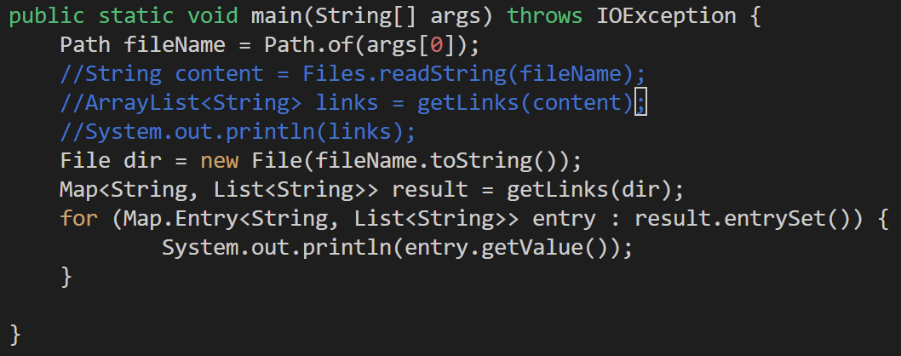
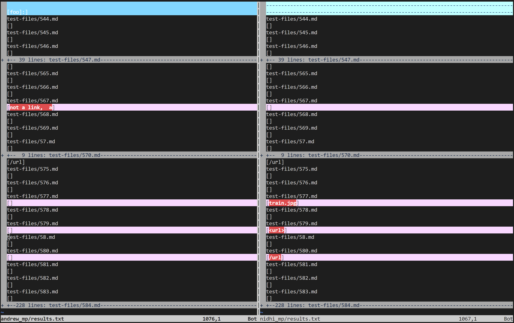
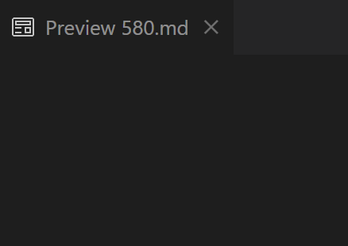
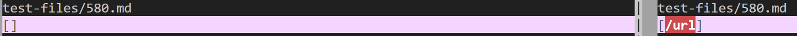
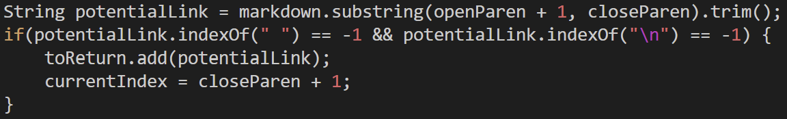
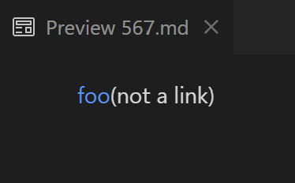
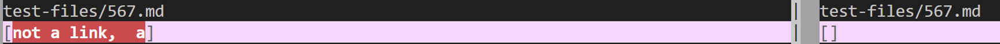
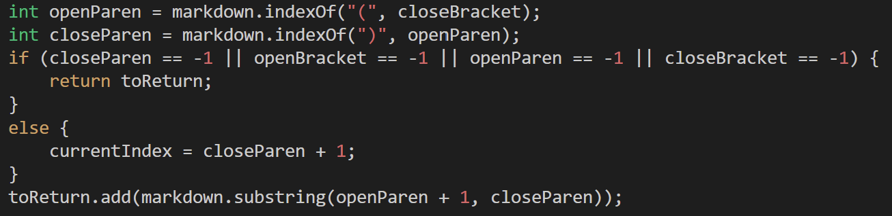

# Lab Report 5
For this lab, I used my lab groupmate Andrew's [markdown parser](https://github.com/A1yip/markdown-parser) with some edits, and the provided one.

* The first thing I did was to edit the main method in both parsers so it would use a ``File`` object instead of a string name of the file itself.

* I then ran ``$ bash script.sh > results.txt`` in both directories to produce the results for each test file and redirect them to a text file.
* I then used ``vimdiff`` with both of the results text files to find the test files with different results.

## Test File ``580.md``
* [Link to test file ``580.md``](https://github.com/nidhidhamnani/markdown-parser/blob/main/test-files/580.md?plain=1)
* VSCode preview (empty):

* Actual outputs (Andrew | Provided):

* Expected output: ``[]``
* As we can see, the provided code output is incorrect. ``/url`` is not a valid URL, and therefore should not be included in the output. However, this would be a very involved fix, as there is no URL validation in place (in either implementation for that matter). It would probably be a good idea to have a validation method that makes sure that the string enclosed in the parenthesis is a valid link that is called after declaring ``potentialLink``: 

## Test File ``567.md``
* [Link to test file ``567.md``](https://github.com/nidhidhamnani/markdown-parser/blob/main/test-files/567.md?plain=1)
* VSCode preview:

* Actual outputs (Andrew | Provided):

* Expected output: ``[]``
* As we can see, Andrew's output is incorrect. Firstly, ``not a link`` is not a valid URL, which would once again be a very involved fix to validate the URLs before adding them to the results. We also got an extra ``a`` in the results, which indicates that there is an error when we change the indices to capture the next links. More specifically, we would need to be more careful when creating the substring (the last line).

